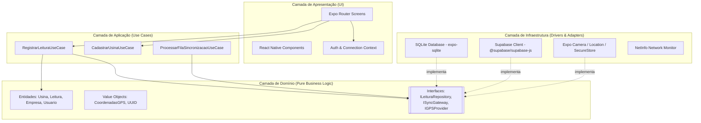
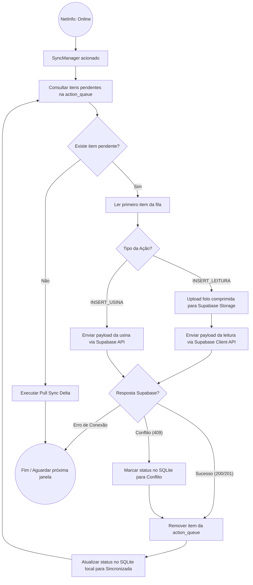

# Equinox Mobile ☀️

**Sistema de Gestão e Monitoramento de Usinas Fotovoltaicas**

O Equinox Mobile é um aplicativo **100% Mobile, Multi-Tenant e Offline-First**, desenvolvido para permitir que técnicos em campo realizem vistorias e registrem leituras de geração de energia em usinas solares, mesmo em locais remotos e sem conectividade com a internet.

---

## 🚀 Principais Funcionalidades

- **Sincronização Offline-First:** O aplicativo funciona de forma contínua sem internet. Todos os dados são salvos localmente e enviados para a nuvem automaticamente assim que a conexão é restabelecida.
- **Gerenciamento de Multi-Tenancy:** Estrutura escalável para atender diversas Empresas (Tenants), Usinas e Usuários com rígido controle de acesso baseado em RLS (Row Level Security).
- **Prova de Presença (Proof of Presence):** Validação de localização via GPS para garantir que a leitura foi feita fisicamente na usina correta.
- **Otimização de Mídia:** Compressão automática local de fotos de relógios medidores (máx 1080p, ~300KB) para garantir uploads bem-sucedidos em redes 3G rurais.

---

## 🛠️ Stack Tecnológica

O sistema foi desenhado seguindo a filosofia de **Clean Architecture**, **Domain-Driven Design (DDD)** e **Test-Driven Development (TDD)**, utilizando as seguintes tecnologias:

- **Plataforma/Framework:** React Native + Expo SDK 57 (Expo Router)
- **Linguagem:** TypeScript v5+ (`strict: true`)
- **Backend / Nuvem:** Supabase (Auth, Storage, PostgreSQL)
- **Persistência Local:** SQLite (Fonte Única de Verdade em modo offline)
- **Testes:** Jest + `@testing-library/react-native`
- **Validação de Formulários:** Zod + React Hook Form

---

## 🏗️ Arquitetura do Sistema

O projeto adota a Arquitetura Limpa (Clean Architecture), isolando completamente a lógica de negócios da infraestrutura e interface do usuário.

---

## 🔄 Motor de Sincronização (Offline-First)

A arquitetura garante que nenhuma informação seja perdida. Se o app estiver offline, as ações são enfileiradas. Quando a rede volta, o **SyncManager** orquestra o envio dos arquivos de mídia e JSONs.

---

## 📚 Documentação Técnica Completa

Para um aprofundamento na arquitetura, modelos de dados e diretrizes do sistema, consulte os arquivos abaixo:

- [📝 Regras de Arquitetura e Agentes (AGENTS.md)](./AGENTS.md)
- [📖 Documentação de Software Completa](./docs/documento-software.md)
- [⚖️ Registro de Decisões de Arquitetura (ADRs)](./docs/decisions.md)
- [📊 Matriz de Rastreabilidade (TDD)](./docs/design/matriz_rastreabilidade_tdd.md)
- [🗄️ Schemas de Banco de Dados (SQLite e Supabase)](./docs/design/)
- [🗺️ Diagramas UML Detalhados](./docs/diagrams/)
