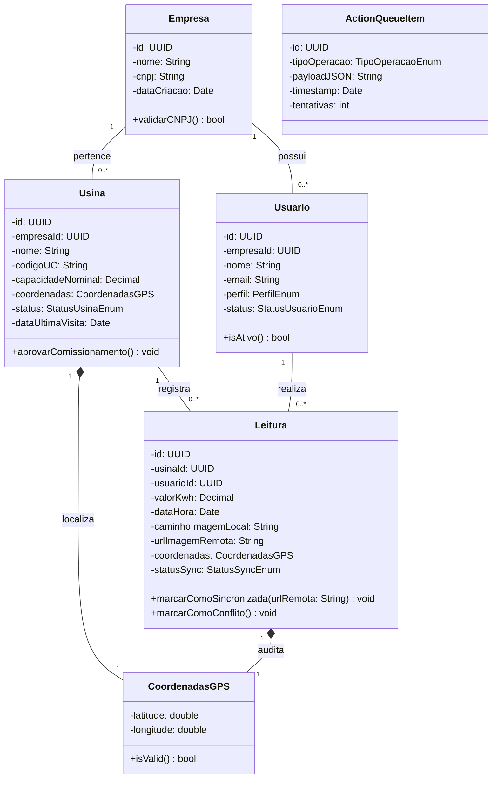
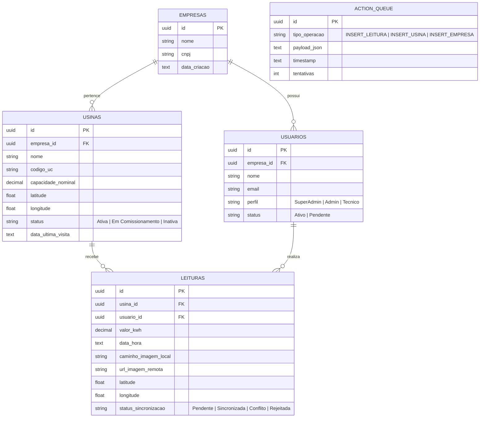

# Diagrama de Classes e DER — Equinox Mobile

## 1. Diagrama de Classes de Domínio

```mermaid
classDiagram
    class Empresa {
        -id: UUID
        -nome: String
        -cnpj: String
        -dataCriacao: Date
        +validarCNPJ() bool
    }

    class Usuario {
        -id: UUID
        -empresaId: UUID
        -nome: String
        -email: String
        -perfil: PerfilEnum
        -status: StatusUsuarioEnum
        +isAtivo() bool
    }

    class Usina {
        -id: UUID
        -empresaId: UUID
        -nome: String
        -codigoUC: String
        -capacidadeNominal: Decimal
        -coordenadas: CoordenadasGPS
        -status: StatusUsinaEnum
        -dataUltimaVisita: Date
        +aprovarComissionamento() void
    }

    class Leitura {
        -id: UUID
        -usinaId: UUID
        -usuarioId: UUID
        -valorKwh: Decimal
        -dataHora: Date
        -caminhoImagemLocal: String
        -urlImagemRemota: String
        -coordenadas: CoordenadasGPS
        -statusSync: StatusSyncEnum
        +marcarComoSincronizada(urlRemota: String) void
        +marcarComoConflito() void
    }

    class CoordenadasGPS {
        -latitude: double
        -longitude: double
        +isValid() bool
    }

    class ActionQueueItem {
        -id: UUID
        -tipoOperacao: TipoOperacaoEnum
        -payloadJSON: String
        -timestamp: Date
        -tentativas: int
    }

    Empresa "1" -- "0..*" Usuario : possui
    Empresa "1" -- "0..*" Usina : pertence
    Usina "1" -- "0..*" Leitura : registra
    Usuario "1" -- "0..*" Leitura : realiza
    Usina "1" *-- "1" CoordenadasGPS : localiza
    Leitura "1" *-- "1" CoordenadasGPS : audita
```

## 2. Diagrama Entidade-Relacionamento (DER)

```mermaid
erDiagram
    EMPRESAS ||--o{ USUARIOS : possui
    EMPRESAS ||--o{ USINAS : pertence
    USINAS ||--o{ LEITURAS : recebe
    USUARIOS ||--o{ LEITURAS : realiza

    EMPRESAS {
        uuid id PK
        string nome
        string cnpj
        text data_criacao
    }

    USUARIOS {
        uuid id PK
        uuid empresa_id FK
        string nome
        string email
        string perfil "SuperAdmin | Admin | Tecnico"
        string status "Ativo | Pendente"
    }

    USINAS {
        uuid id PK
        uuid empresa_id FK
        string nome
        string codigo_uc
        decimal capacidade_nominal
        float latitude
        float longitude
        string status "Ativa | Em Comissionamento | Inativa"
        text data_ultima_visita
    }

    LEITURAS {
        uuid id PK
        uuid usina_id FK
        uuid usuario_id FK
        decimal valor_kwh
        text data_hora
        string caminho_imagem_local
        string url_imagem_remota
        float latitude
        float longitude
        string status_sincronizacao "Pendente | Sincronizada | Conflito | Rejeitada"
    }

    ACTION_QUEUE {
        uuid id PK
        string tipo_operacao "INSERT_LEITURA | INSERT_USINA | INSERT_EMPRESA"
        text payload_json
        text timestamp
        int tentativas
    }
```
