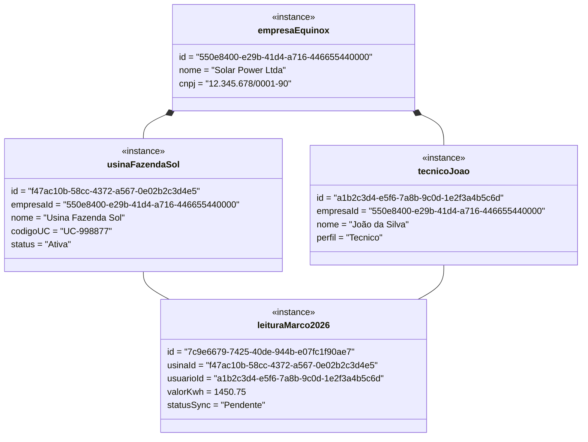
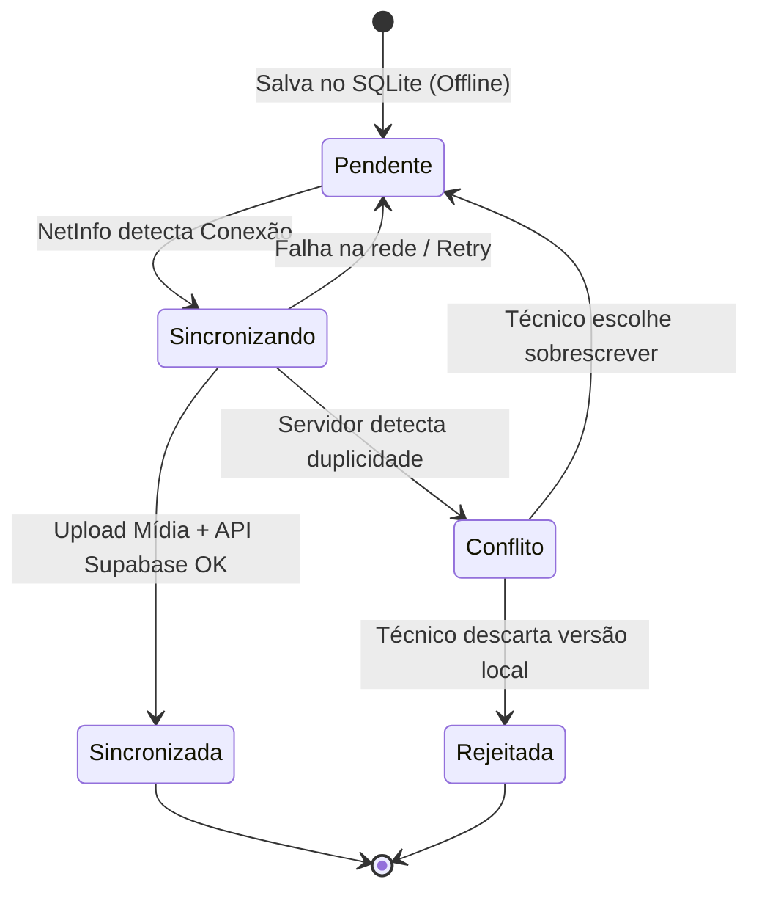
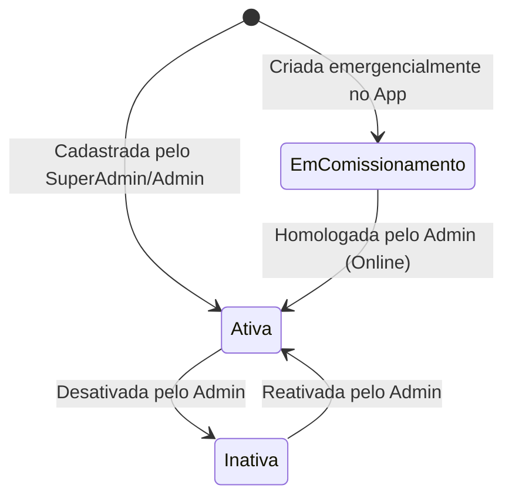

# Diagrama de Objetos e Estados — Equinox Mobile

## 1. Diagrama de Objetos (Exemplo de Instância)

```mermaid
classDiagram
    class empresaEquinox {
        <<instance>>
        id = "550e8400-e29b-41d4-a716-446655440000"
        nome = "Solar Power Ltda"
        cnpj = "12.345.678/0001-90"
    }

    class tecnicoJoao {
        <<instance>>
        id = "a1b2c3d4-e5f6-7a8b-9c0d-1e2f3a4b5c6d"
        empresaId = "550e8400-e29b-41d4-a716-446655440000"
        nome = "João da Silva"
        perfil = "Tecnico"
    }

    class usinaFazendaSol {
        <<instance>>
        id = "f47ac10b-58cc-4372-a567-0e02b2c3d4e5"
        empresaId = "550e8400-e29b-41d4-a716-446655440000"
        nome = "Usina Fazenda Sol"
        codigoUC = "UC-998877"
        status = "Ativa"
    }

    class leituraMarco2026 {
        <<instance>>
        id = "7c9e6679-7425-40de-944b-e07fc1f90ae7"
        usinaId = "f47ac10b-58cc-4372-a567-0e02b2c3d4e5"
        usuarioId = "a1b2c3d4-e5f6-7a8b-9c0d-1e2f3a4b5c6d"
        valorKwh = 1450.75
        statusSync = "Pendente"
    }

    empresaEquinox *-- tecnicoJoao
    empresaEquinox *-- usinaFazendaSol
    usinaFazendaSol -- leituraMarco2026
    tecnicoJoao -- leituraMarco2026
```

## 2. Ciclo de Vida da Entidade `Leitura`

```mermaid
stateDiagram-v2
    [*] --> Pendente : Salva no SQLite (Offline)
    Pendente --> Sincronizando : NetInfo detecta Conexão
    Sincronizando --> Sincronizada : Upload Mídia + API Supabase OK
    Sincronizando --> Conflito : Servidor detecta duplicidade
    Sincronizando --> Pendente : Falha na rede / Retry
    Conflito --> Pendente : Técnico escolhe sobrescrever
    Conflito --> Rejeitada : Técnico descarta versão local
    Sincronizada --> [*]
    Rejeitada --> [*]
```

## 3. Ciclo de Vida da Entidade `Usina`

```mermaid
stateDiagram-v2
    [*] --> EmComissionamento : Criada emergencialmente no App
    [*] --> Ativa : Cadastrada pelo SuperAdmin/Admin
    EmComissionamento --> Ativa : Homologada pelo Admin (Online)
    Ativa --> Inativa : Desativada pelo Admin
    Inativa --> Ativa : Reativada pelo Admin
```
