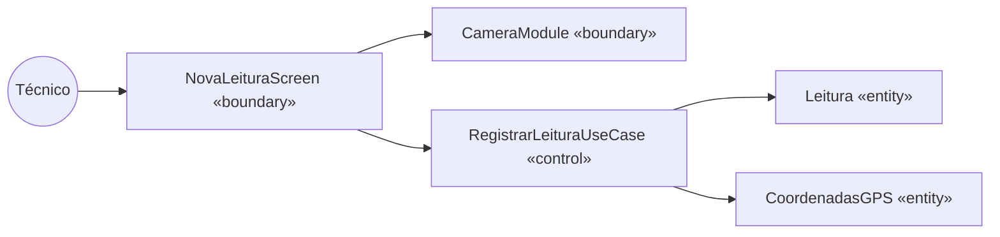
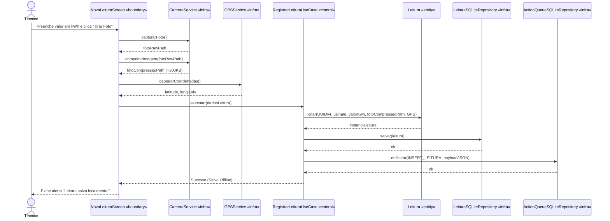
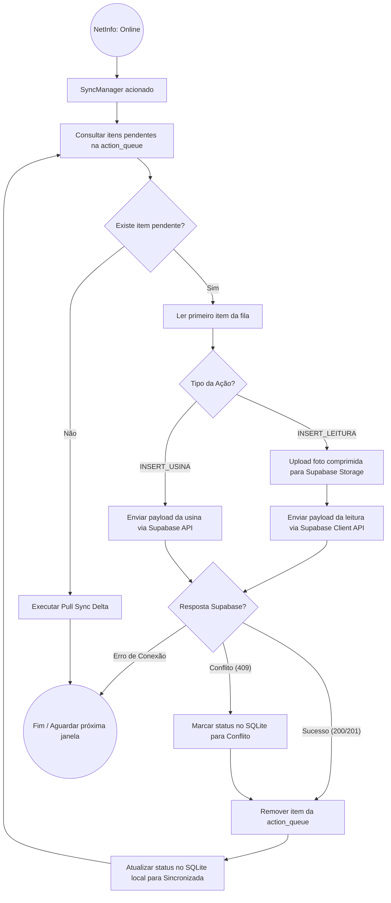
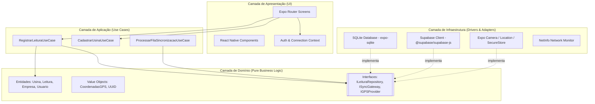

# Diagramas Dinâmicos e Arquiteturais — Equinox Mobile

## 1. Mapeamento BCE (Boundary-Control-Entity)

## 2. Diagrama de Sequência (Fluxo Offline de Nova Leitura)

## 3. Diagrama de Atividades (Engine de Sincronização)

## 4. Diagrama de Componentes (Clean Architecture)

