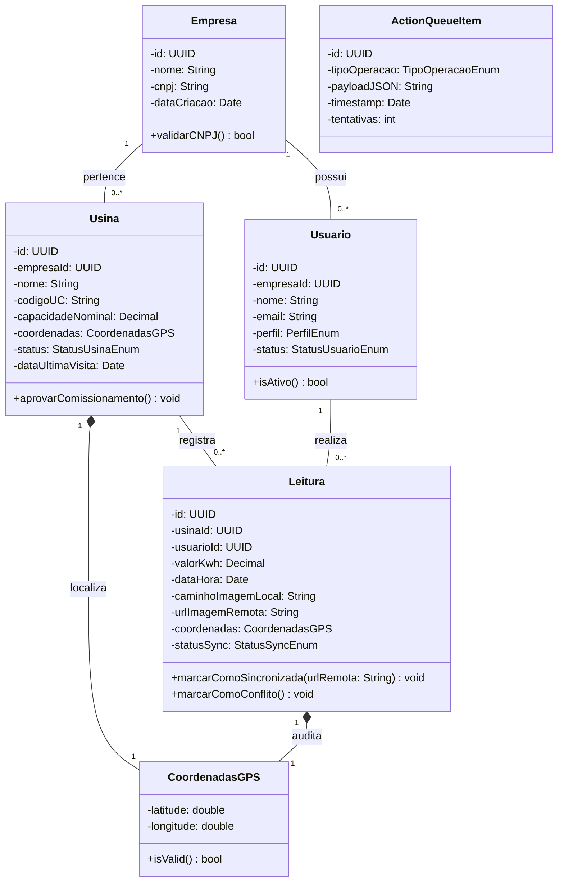
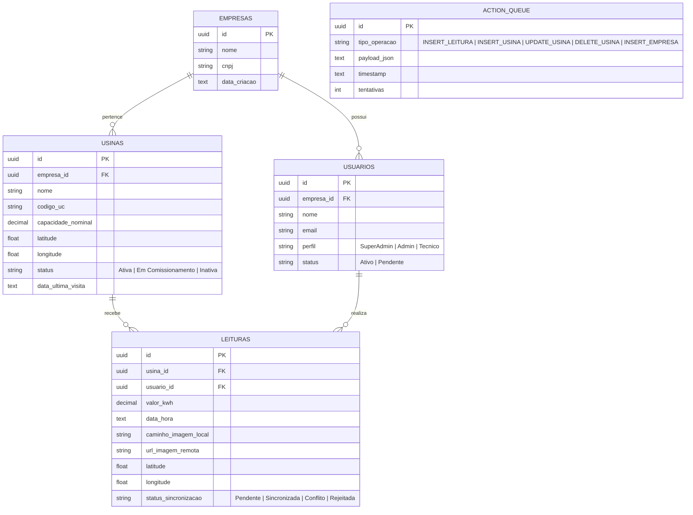
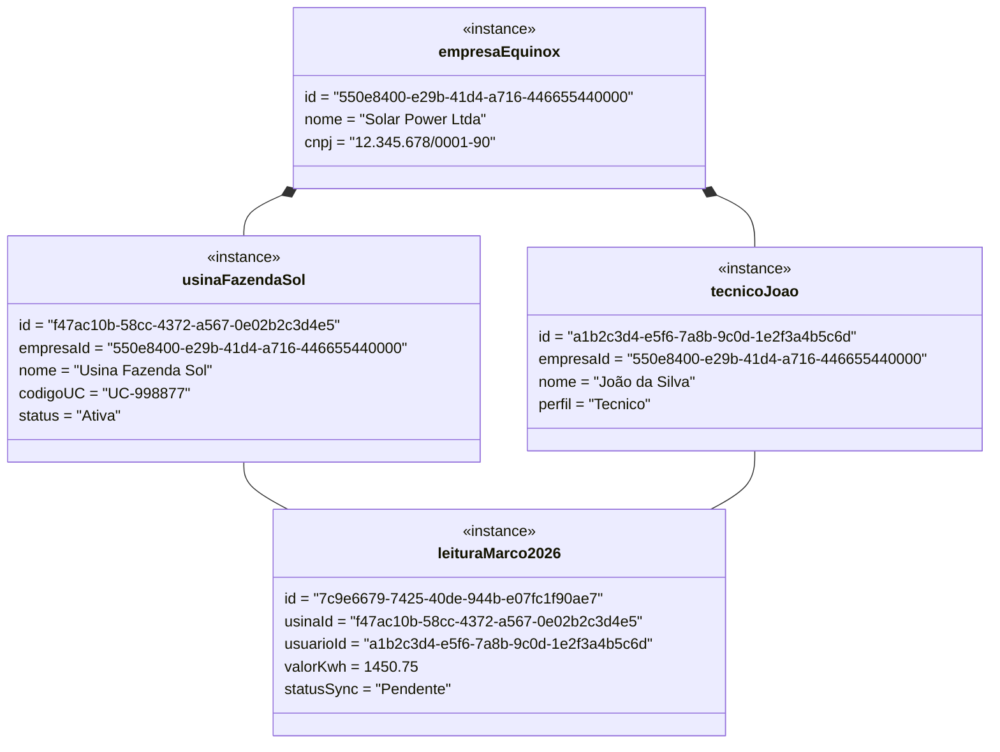
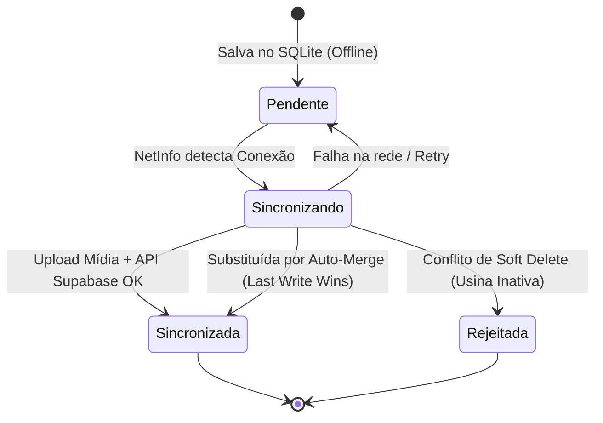
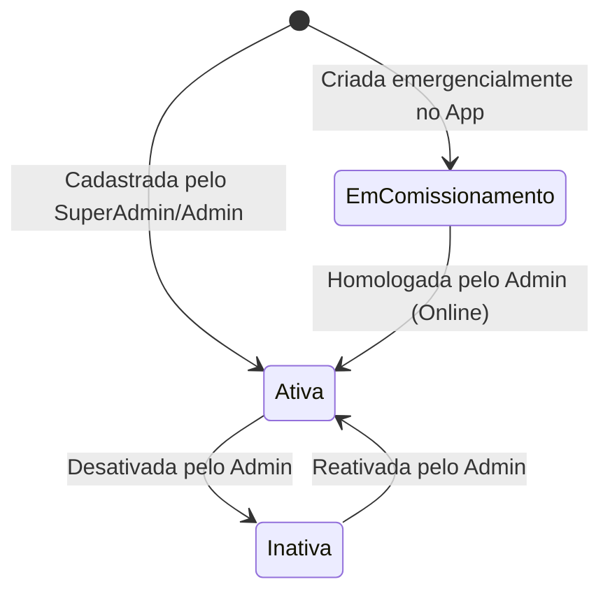
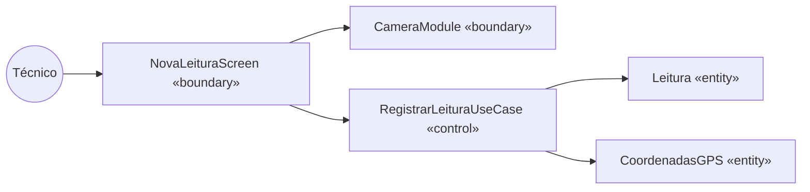
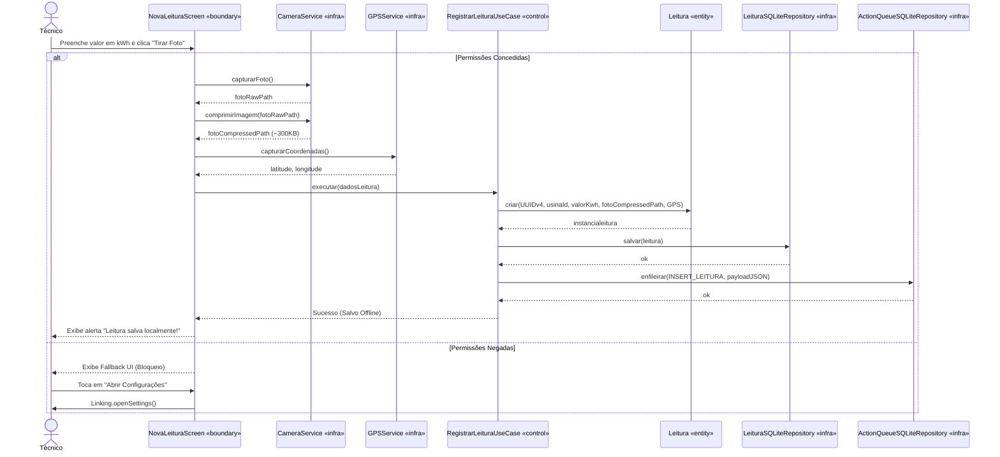
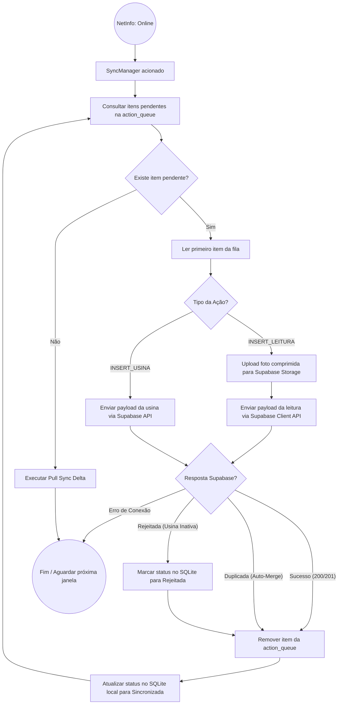
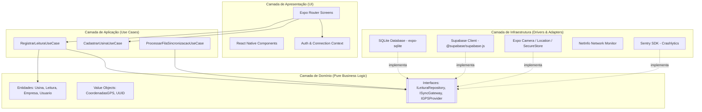

# Documento de Especificação de Software (Análise e Projeto) — Equinox Mobile

Documento de especificação técnica do aplicativo móvel **Equinox Mobile**, um sistema 100% mobile, multi-tenant e offline-first para gestão de usinas fotovoltaicas e coleta georreferenciada de leituras de medidores de energia solar.

---

## 1. Levantamento de Requisitos

### 1.1 Requisitos Funcionais (RF)

| ID | Descrição | Prioridade | Ator / Origem |
|----|-----------|-----------|---------------|
| **RF01** | O sistema deve permitir a autenticação de usuários via email e senha com validação remota (online) e validação local de sessão salva via `expo-secure-store` (offline). | Alta | Todos os Atores |
| **RF02** | O sistema deve permitir que o **SuperAdmin** cadastre novas Empresas clientes (Tenants) no sistema. | Alta | SuperAdmin |
| **RF03** | O sistema deve permitir que o **SuperAdmin** e o **Admin** realizem o pré-cadastro de Usinas Fotovoltaicas vinculadas a uma Empresa. | Alta | SuperAdmin, Admin |
| **RF04** | O sistema deve permitir que o **Admin** aprove ou cadastre novos funcionários/técnicos pertencentes à sua empresa. | Alta | Admin |
| **RF05** | O sistema deve permitir a consulta e busca offline do catálogo de Usinas pertencentes à empresa do usuário logado. | Alta | Técnico, Admin |
| **RF06** | O sistema deve permitir que o **Técnico** registre uma Nova Leitura de medidor em campo (kWh de consumo/geração), exigindo captura de foto comprobatória e coordenadas GPS. | Alta | Técnico |
| **RF07** | O sistema deve permitir o cadastro emergencial de novas Usinas em campo por **Técnicos** quando desconectados, atribuindo o status inicial `Em Comissionamento`. | Média | Técnico |
| **RF08** | O sistema deve comprimir a foto tirada pela câmera (máx. 1080p, JPEG 70-80%, ~300KB) antes de gravá-la na memória física e no banco local. | Alta | Sistema (Infra) |
| **RF09** | O sistema deve registrar toda operação realizada offline (inserção de leitura, usina ou empresa) na fila transacional local (`action_queue`). | Alta | Sistema (Domain/Infra) |
| **RF10** | O sistema deve executar a sincronização assíncrona da `action_queue` (Push Sync) assim que a conexão de internet for detectada pelo `@react-native-community/netinfo`. | Alta | Sistema (SyncManager) |
| **RF11** | O sistema deve realizar a carga inicial e atualização delta (Pull Sync) trazendo do Supabase apenas dados que o usuário tem permissão de visualizar via RLS. | Alta | Sistema (SyncManager) |
| **RF12** | O sistema deve resolver leituras duplicadas automaticamente usando "Last Write Wins", salvando a mais recente, notificando o usuário silenciosamente sem exigir intervenção manual. | Média | Sistema (SyncManager) |
| **RF13** | O sistema deve exigir conectividade com a internet obrigatoriamente no primeiro acesso (Cold Start) para carga inicial do catálogo e configuração de sessão. | Alta | Sistema |
| **RF14** | O sistema deve bloquear a interface de Nova Leitura com uma *Fallback UI* redirecionando às Configurações caso as permissões de Câmera e Localização sejam negadas permanentemente. | Alta | App / Técnico |

### 1.2 Requisitos Não-Funcionais (RNF)

| ID | Categoria | Descrição | Critério Mensurável | Prioridade |
|----|-----------|-----------|----------------------|------------|
| **RNF01** | Arquitetura | O código fonte do aplicativo deve seguir estritamente Clean Architecture e DDD. | Camada de Domínio (`src/domain`) sem nenhuma importação de UI, SQLite ou Supabase. | Alta |
| **RNF02** | Testabilidade | O sistema deve ser desenvolvido utilizando Test-Driven Development (TDD). | 100% de cobertura de testes unitários nas camadas de Domínio e Casos de Uso. | Alta |
| **RNF03** | Persistência | Todas as tabelas locais (SQLite) e remotas (Supabase) devem utilizar UUIDv4 gerados no Domínio como Chave Primária. | Nenhuma PK auto-incremental; validação de formato UUIDv4 em todas as entidades. | Alta |
| **RNF04** | Performance | A compressão da imagem capturada em campo deve ser executada em segundo plano sem travar a UI. | Tempo de processamento da imagem < 800ms em dispositivos intermediários. | Alta |
| **RNF05** | Segurança | Tokens JWT e credenciais de sessão local devem ser gravados de forma criptografada. | Uso obrigatório do `expo-secure-store` para persistência de tokens. | Alta |
| **RNF06** | Usabilidade | A interface deve indicar visualmente e em tempo real o estado da conexão (Online/Offline) e o número de pendências na fila de sincronização. | Indicador no cabeçalho atualizado em tempo real via hook `useConnectionState`. | Alta |
| **RNF07** | Persistência (Expurgo) | O sistema deve expurgar dados locais antigos para economizar armazenamento. | Limpeza automática de leituras (status `Sincronizada`) e fotos criadas há mais de 30 dias. | Média |
| **RNF08** | Persistência (Migrações) | O banco de dados local (SQLite) deve suportar versionamento e execução de migrações. | Execução de scripts sequenciais sem perda de dados na tela de Splash. | Alta |
| **RNF09** | Observabilidade | O app deve monitorar e armazenar *crashes* offline. | Integração do Sentry capturando erros na `action_queue`. | Alta |
| **RNF10** | CI/CD | O pipeline de build e envio de atualizações *Over-The-Air* deve utilizar ecossistema oficial. | Configuração do EAS Build e EAS Update no projeto. | Média |

---

## 2. Diagrama de Casos de Uso

### 2.1 Atores do Sistema
- **Usuário (Geral):** Ator base abstrato que possui sessão e consulta perfil.
- **SuperAdmin:** Herda de Usuário. Administrador da plataforma Equinox.
- **Admin:** Herda de Usuário. Gestor de uma Empresa/Tenant específica.
- **Técnico:** Herda de Usuário. Operador em campo que realiza leituras e vistorias.

### 2.2 Diagrama Mermaid

```mermaid
flowchart LR
    Usuario((Usuário))
    SuperAdmin((SuperAdmin))
    Admin((Admin))
    Tecnico((Técnico))

    SuperAdmin --|> Usuario
    Admin --|> Usuario
    Tecnico --|> Usuario

    Usuario --> UC01[Autenticar no App]
    UC01 -.include.-> UC02[Validar Credenciais / Token SecureStore]

    SuperAdmin --> UC03[Cadastrar Empresa]
    SuperAdmin --> UC04[Vincular Usina a Empresa]

    Admin --> UC05[Gerenciar/Aprovar Técnicos]
    Admin --> UC04

    Tecnico --> UC06[Consultar Usinas Offline]
    Tecnico --> UC07[Registrar Nova Leitura]
    UC07 -.include.-> UC08[Capturar Foto Medidor]
    UC07 -.include.-> UC09[Capturar Coordenadas GPS]
    UC08 -.include.-> UC10[Comprimir Imagem JPEG]
    
    Tecnico --> UC11[Cadastrar Usina Emergencial]

    Usuario --> UC12[Sincronizar Dados]
    UC12 -.include.-> UC13[Processar Action Queue Push]
    UC12 -.include.-> UC14[Executar Pull Sync Delta]
    UC15[Auto-Merge Last Write Wins] -.extend.-> UC13
    Usuario --> UC16[Recuperar Senha Online]
```

### 2.3 Descrição Textual dos Casos de Uso Principais

#### UC07 — Registrar Nova Leitura
- **Ator Principal:** Técnico.
- **Pré-condição:** Técnico autenticado e com a Usina selecionada no app.
- **Fluxo Principal:**
  1. Técnico acessa o formulário de Nova Leitura para a Usina selecionada.
  2. Informa a medição de consumo/geração (kWh).
  3. O app dispara a câmera nativa (`expo-camera`) e o técnico captura a foto do medidor.
  4. O app obtém as coordenadas GPS atuais (`expo-location`).
  5. O app comprime a foto (JPEG 1080p, ~300KB) e salva no `FileSystem`.
  6. O app cria a entidade `Leitura` (com UUIDv4 e status `Pendente`) e persiste no SQLite.
  7. O app registra o payload na `action_queue`.
- **Fluxo Alternativo (Sem sinal de GPS preciso):** Caso o GPS falhe, o app solicita permissão para tentar novamente ou alerta falta de precisão antes de salvar.
- **Fluxo Alternativo (Permissão Negada):** Caso o acesso à Câmera ou GPS seja negado, o aplicativo exibe uma Fallback UI que bloqueia a leitura e direciona o usuário para as Configurações do Dispositivo.
- **Pós-condição:** Leitura salva no SQLite local e inserida na fila de sincronização.

#### UC12 — Sincronizar Dados (SyncManager)
- **Ator Principal:** Sistema (SyncManager) ou Disparo Manual do Usuário.
- **Pré-condição:** Dispositivo recuperar conectividade com a internet.
- **Fluxo Principal:**
  1. O `SyncManager` varre os registros pendentes da `action_queue`.
  2. Para cada item da fila (ex: `INSERT_LEITURA`), envia a foto para o bucket `comprovantes` do Supabase Storage e depois envia a leitura para a tabela remota `leituras`.
  3. Com o sucesso da requisição, o item é removido da `action_queue` e o status da leitura no SQLite muda para `Sincronizada`.
  4. O `SyncManager` executa o Pull Sync para atualizar registros modificados no servidor.
- **Fluxo Alternativo (Conflito de Leitura):** Se a API retornar erro de duplicidade, o sistema aplica o "Last Write Wins" validando a `data_hora` mais recente e notifica o operador no celular ("Registro atualizado com versão mais recente"), resolvendo sem travar a tela.
- **Fluxo Alternativo (Usina Inativa - Soft Delete):** Se a API rejeitar a leitura por apontar a uma Usina que foi desativada no servidor, a leitura é marcada com o status `Rejeitada` no celular e o usuário é notificado.
- **Pós-condição:** Banco local e remoto sincronizados sem perda de dados.

---

## 3. Diagrama de Classes e Persistência

### 3.1 Diagrama de Classes de Domínio



### 3.2 Mapeamento de Persistência

| Classe | Persistente? | Estratégia Local (SQLite) | Estratégia Remota (Supabase) | Observação |
|--------|-------------|----------------------------|------------------------------|------------|
| **Empresa** | Sim | Tabela `empresas` (PK: id UUID) | Tabela `empresas` (PK: id UUID) | Entidade Raiz |
| **Usuario** | Sim | Tabela `usuarios` (PK: id UUID, FK: empresa_id) | Tabela `profiles` (estende `auth.users`) | Multi-tenant por RLS |
| **Usina** | Sim | Tabela `usinas` (PK: id UUID, FK: empresa_id) | Tabela `usinas` (PK: id UUID) | Suporta criação offline |
| **Leitura** | Sim | Tabela `leituras` (PK: id UUID) | Tabela `leituras` (PK: id UUID) | Mídia enviada para Storage |
| **CoordenadasGPS** | Não (VO) | Colunas `latitude`, `longitude` embutidas | Colunas `latitude`, `longitude` embutidas | Value Object imutável |
| **ActionQueueItem** | Sim | Tabela `action_queue` (PK: id UUID) | Não se aplica (Exclusivo Local) | Log transacional offline |

---

## 3.1 Diagrama Entidade-Relacionamento (DER)



---

## 4. Diagrama de Objetos (Exemplo de Instância)

Instantâneo do sistema exemplificando o registro de uma leitura em campo:



---

## 5. Diagramas de Estados

### 5.1 Ciclo de Vida da Entidade `Leitura`



### 5.2 Ciclo de Vida da Entidade `Usina`



---

## 6. Mapeamento BCE (Boundary-Control-Entity)

| Caso de Uso | Boundary (Fronteira) | Control (Controle / Use Case) | Entities Envolvidas |
|-------------|----------------------|--------------------------------|---------------------|
| **Autenticar** | `LoginScreen`, `AuthPresenter` | `AutenticarUsuarioUseCase` | `Usuario` |
| **Registrar Leitura** | `NovaLeituraScreen`, `CameraModule`, `GPSModule` | `RegistrarLeituraUseCase` | `Leitura`, `Usina`, `CoordenadasGPS` |
| **Cadastrar Usina** | `NovaUsinaScreen` | `CadastrarUsinaUseCase` | `Usina`, `Empresa`, `CoordenadasGPS` |
| **Recuperar Senha** | `RecuperarSenhaScreen` | `RecuperarSenhaUseCase` | `Usuario` |
| **Sincronizar Dados** | `SyncHeaderStatusView`, `SyncButtonView` | `ProcessarFilaSincronizacaoUseCase`, `ExecutarPullSyncUseCase` | `ActionQueueItem`, `Leitura`, `Usina` |



---

## 7. Diagrama de Sequência (Fluxo Offline de Nova Leitura)



---

## 8. Diagrama de Atividades (Sincronização em Segundo Plano)



---

## 9. Diagrama de Componentes (Clean Architecture)



---

## 10. Mapeamento DDD, Clean Architecture e Plano de Testes TDD

### 10.1 Estrutura de Diretórios (`src/`)

```
src/
├── domain/                         # Camada de Domínio (Sem libs externas)
│   ├── entities/                   # Empresa.ts, Usuario.ts, Usina.ts, Leitura.ts
│   ├── value-objects/              # CoordenadasGPS.ts, UUID.ts
│   ├── enums/                      # StatusLeitura.ts, StatusUsina.ts, Perfil.ts
│   └── repositories/               # ILeituraRepository.ts, IUsinaRepository.ts, IActionQueueRepository.ts
│
├── application/                    # Camada de Aplicação (Casos de Uso)
│   ├── use-cases/                  # RegistrarLeituraUseCase.ts, ProcessarFilaUseCase.ts
│   └── dtos/                       # LeituraDTO.ts, UsinaDTO.ts
│
├── infrastructure/                 # Camada de Infraestrutura (Adapters & Hardware)
│   ├── database/
│   │   ├── sqlite/                 # SQLiteConnection.ts, LeituraSQLiteRepository.ts
│   │   └── supabase/               # SupabaseClient.ts, LeituraSupabaseRepository.ts
│   ├── hardware/                   # CameraAdapter.ts, GPSAdapter.ts, SecureStoreAdapter.ts
│   └── sync/                       # SyncManager.ts, NetInfoAdapter.ts
│
└── presentation/                   # Camada de Apresentação (React Native & Expo Router)
    ├── app/                        # Roteamento de rotas (tabs, stacks)
    ├── context/                    # AuthContext.tsx, ConnectionContext.tsx
    ├── hooks/                      # Custom Hooks (detalhados em docs/hooks.md)
    │   ├── context/                # useAuth.ts, useConnectionState.ts, useSync.ts
    │   ├── usecases/               # useLeitura.ts, useUsinas.ts, useCadastrarUsina.ts
    │   ├── hardware/               # useCameraHardware.ts, useGPS.ts, useSecureStore.ts
    │   └── utils/                  # useZodForm.ts, useDebounce.ts
    └── components/                 # Componentes estilizados com NativeWind/StyleSheet
```

> **Catálogo Completo de Hooks:** Consulte [`docs/hooks.md`](./hooks.md) para especificações de interfaces TypeScript, contratos de entrada/saída e cobertura TDD de cada Custom Hook.

### 10.2 Plano de Testes TDD (Ciclo Red -> Green -> Refactor)

#### Testes Unitários de Domínio (`tests/unit/domain`)
1. **`Leitura.spec.ts`:**
   - Deve instanciar uma Leitura válida com UUIDv4 gerado.
   - Deve lançar exceção se o valor da medição (kWh) for negativo.
   - Deve iniciar a Leitura obrigatoriamente com o status `Pendente`.
2. **`CoordenadasGPS.spec.ts`:**
   - Deve validar se latitude (-90 a 90) e longitude (-180 a 180) estão dentro do intervalo geográfico válido.

#### Testes Unitários de Casos de Uso (`tests/unit/application`)
1. **`RegistrarLeituraUseCase.spec.ts`:**
   - Deve salvar a leitura no repositório em memória e enfileirar a ação na `ActionQueue`.
   - Deve falhar se a usina associada não existir no cadastro local.

#### Testes de Integração de Infraestrutura (`tests/integration/infrastructure`)
1. **`LeituraSQLiteRepository.spec.ts`:**
   - Deve inserir e consultar registros de leitura na tabela SQLite real.
2. **`SyncManager.spec.ts`:**
   - Deve consumir os itens da `ActionQueue` quando o estado do `NetInfo` alterar para Online.
