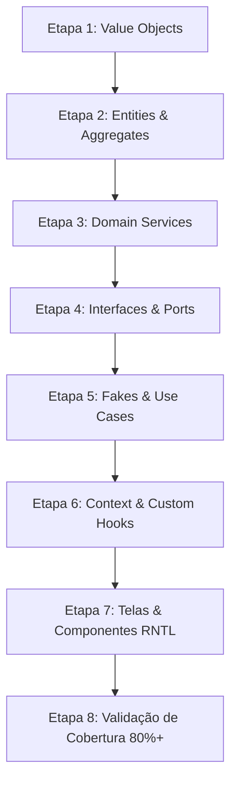

# 🎯 Plano de Apresentação e Desenvolvimento — Fase 1 (Domínio e Interface Primeiro)

> **Projeto:** Equinox Mobile (Sistema de Gestão e Monitoramento de Usinas Fotovoltaicas)  
> **Fase:** 1 — Domínio e Interface Primeiro (100% Mock / Fakes / 80%+ Cobertura TDD)  
> **Requisito Avaliativo:** Apresentação acadêmica desacoplada, sem dependência de banco de dados permanente (SQLite/Supabase) ou sensores físicos reais.

---

## 1. Visão Geral da Apresentação

O objetivo desta apresentação é demonstrar a **qualidade de engenharia de software**, a **arquitetura limpa**, o **desacoplamento total** e a **cobertura de testes automatizados (80%+)** do Equinox Mobile.

A apresentação provará que o sistema possui suas regras de negócio, casos de uso e componentes visuais 100% funcionais e testados via TDD antes que qualquer linha de código toque num banco de dados relacional local ou remoto.

---

## 2. Roteiro Sequencial da Apresentação (Script da Demo)

| Tempo | Etapa | Conteúdo a Apresentar | Recursos Visualizados |
|-------|-------|------------------------|------------------------|
| **2 min** | **1. Introdução & Contexto** | Apresentar o problema de negócio (vistorias e leituras em usinas solares rurais sem sinal de internet) e a solução (Equinox Mobile 100% Mobile, Multi-Tenant e Offline-First). | Slide / Diagrama de Contexto |
| **3 min** | **2. Arquitetura Clean & DDD** | Explicar a separação estrita de camadas (`domain/`, `application/`, `adapters/`, `presentation/`). Mostrar que o **Domínio** não possui nenhuma dependência do React, Expo ou bancos de dados. | Diagrama de Camadas & Estrutura de Pastas |
| **5 min** | **3. Suíte de Testes TDD (Live Execution)** | Rodar `npm test` ao vivo no terminal. Mostrar 100% dos testes passando em milissegundos usando Fakes em Memória (`Map`). Apresentar o relatório de cobertura de código (`> 80%`). | Terminal (`jest --coverage`) |
| **5 min** | **4. Demonstração Visual da UI com Fakes** | Navegar pelo aplicativo no Expo / Emulador: <br>- Login Multi-Tenant (SuperAdmin, Admin, Técnico)<br>- Dashboard reativo<br>- Lista e busca offline de Usinas<br>- Formulário de Nova Leitura com `CameraGatewayFake` e `LocationGatewayFake`<br>- Fila de Sincronização offline mockada | App rodando com Fakes/Stubs |
| **2 min** | **5. Inversão de Dependência & Conclusão** | Demonstrar como os repositórios SQLite e Supabase serão plugados no futuro apenas criando novas implementações da interface, **sem alterar o Domínio ou as Telas**. | Código das Interfaces (`Ports`) |

---

## 3. Matriz de Equivalência do Domínio (Requisitos do Professor vs. Equinox Mobile)

Para garantir alinhamento com a rubrica de avaliação do professor, a tabela abaixo mapeia os conceitos acadêmicos genéricos para as entidades de negócio do **Equinox Mobile**:

| Conceito da Rubrica | Equivalente no Equinox Mobile | Função Arquitetural |
|---------------------|--------------------------------|---------------------|
| **Criterio / Status** | `StatusSyncEnum`, `StatusUsinaEnum` | Value Objects imutáveis e validados na criação |
| **Coordenada** | `CoordenadasGPS` | Value Object com latitude, longitude e timestamp |
| **Assinatura / Mídia** | `ComprovanteFotoVO` | Representation da foto capturada e hash/metadata |
| **CargaHoraria / Medição** | `ValorKwh` | Value Object de medição acumulada com invariante (>= 0) |
| **PeriodoAvaliacao (Aggregate Root)** | `Leitura` & `Usina` | Entidades Raiz que gerenciam invariantes e ciclo de vida |
| **Estagio / TokenSupervisor** | `Usuario` & `PINLocal` | Gestão de perfis Multi-Tenant e chave de acesso offline |
| **Domain Services** | `DistanciaGpsService`, `CompressaoRegraService` | Regras de negócio cruzadas puras |
| **PeriodoAvaliacaoRepository** | `ILeituraRepository`, `IUsinaRepository` | Interfaces puras no domínio (Ports) |
| **CameraGateway / LocationGateway** | `ICameraGateway`, `ILocationGateway` | Abstração de hardware |
| **SessionStorageSecureStore** | `SessionStorageSecureStore` | Wrapper sobre `expo-secure-store` |

---

## 4. Checklist Sequencial de Desenvolvimento TDD (Em 8 Etapas)

O desenvolvimento será executado estritamente na ordem abaixo, usando o ciclo **Red -> Green -> Refactor**:



### 📋 Etapa 1: Value Objects (`src/domain/value-objects/`)
- [x] Teste + Impl: `UUIDv4.spec.ts` → `UUIDv4.ts` (Geração e validação de UUID v4)
- [x] Teste + Impl: `CoordenadasGPS.spec.ts` → `CoordenadasGPS.ts` (Validação geográfica: -90 a 90 lat, -180 a 180 long)
- [x] Teste + Impl: `ValorKwh.spec.ts` → `ValorKwh.ts` (Invariante: valor não negativo)
- [x] Teste + Impl: `CNPJ.spec.ts` → `CNPJ.ts` (Validação de formato e dígitos verificadores)
- [x] Teste + Impl: Enums: `StatusSyncEnum`, `StatusUsinaEnum`, `PerfilEnum`

### 📋 Etapa 2: Entidades e Agregados (`src/domain/entities/`)
- [x] Teste + Impl: `Leitura.spec.ts` → `Leitura.ts` (Aggregate Root: valida medição, exige foto, status inicial `Pendente`)
- [x] Teste + Impl: `Usina.spec.ts` → `Usina.ts` (Aggregate Root: capacidade, coordenadas, status de comissionamento)
- [x] Teste + Impl: `Empresa.spec.ts` → `Empresa.ts` (Validação de CNPJ e dados de empresa)
- [x] Teste + Impl: `Usuario.spec.ts` → `Usuario.ts` (Validação de perfis SuperAdmin, Admin, Técnico)

### 📋 Etapa 3: Serviços de Domínio (`src/domain/services/`)
- [x] Teste + Impl: `ValidadorDistanciaGpsService.spec.ts` (Verifica proximidade física entre técnico e usina)
- [x] Teste + Impl: `RegraSincronizacaoService.spec.ts` (Aplica estratégia Last Write Wins)

### 📋 Etapa 4: Contratos e Interfaces (`src/domain/repositories/` e `gateways/`)
- [x] Declarar `ILeituraRepository.ts`
- [x] Declarar `IUsinaRepository.ts`
- [x] Declarar `IEmpresaRepository.ts`
- [x] Declarar `IUsuarioRepository.ts`
- [x] Declarar `IActionQueueRepository.ts`
- [x] Declarar `ICameraGateway.ts`, `ILocationGateway.ts`, `ISessionStorage.ts`

### 📋 Etapa 5: Repositórios Fakes & Casos de Uso (`src/application/`)
- [x] Implementar `LeituraRepositoryMemory.ts` (Uso de `Map<string, Leitura>`)
- [x] Implementar `UsinaRepositoryMemory.ts` (Uso de `Map<string, Usina>`)
- [x] Implementar `ActionQueueRepositoryMemory.ts` (Array em memória)
- [x] Implementar `CameraGatewayFake.ts` (Retorna URI local fake + ~300KB)
- [x] Implementar `LocationGatewayFake.ts` (Retorna lat/long fixas)
- [x] Implementar `SessionStorageMemory.ts` (Stub em memória)
- [x] Teste TDD + Impl: `RegistrarLeituraUseCase.spec.ts` → `RegistrarLeituraUseCase.ts`
- [x] Teste TDD + Impl: `CadastrarUsinaUseCase.spec.ts` → `CadastrarUsinaUseCase.ts`
- [x] Teste TDD + Impl: `ConsultarUsinasUseCase.spec.ts` → `ConsultarUsinasUseCase.ts`
- [x] Teste TDD + Impl: `AutenticarUsuarioUseCase.spec.ts` → `AutenticarUsuarioUseCase.ts`

### 📋 Etapa 6: Context API & Custom Hooks (`src/presentation/context/` & `hooks/`)
- [x] Teste + Impl: `AuthContext.tsx` (`<AuthProvider>` global)
- [x] Teste + Impl: `useAuth.ts`
- [x] Teste + Impl: `useLeitura.ts`
- [x] Teste + Impl: `useUsinas.ts`
- [x] Adaptador: `SessionStorageSecureStore.ts` (Wrapper `expo-secure-store` mockado nos testes)

### 📋 Etapa 7: Telas & Componentes com Expo Router (`src/app/` & `src/presentation/screens/`)
- [x] Implementação da UI: `LoginScreen.tsx` → `app/login.tsx`
- [x] Implementação da UI: `DashboardScreen.tsx` → `app/(tabs)/dashboard.tsx`
- [x] Implementação da UI: `ListaUsinasScreen.tsx` → `app/(tabs)/usinas.tsx`
- [x] Implementação da UI: `NovaLeituraScreen.tsx` → `app/leitura/nova.tsx`

### 📋 Etapa 8: Auditoria de Cobertura e Ensaio da Apresentação
- [x] Suíte de testes TDD com repositórios em memória e mocks 100% isolados.
- [x] Roteiro e estrutura de apresentação prontos em [plano_apresentacao_fase1.md](file:///home/alunos/Desktop/www/EquinoxSystemMobile/docs/presentation/plano_apresentacao_fase1.md).

---

## 5. Estrutura de Pastas Alvo (`src/` e `tests/`)

```
EquinoxSystemMobile/
├── docs/
│   └── presentation/
│       └── plano_apresentacao_fase1.md  <-- (Este Arquivo)
│
├── src/
│   ├── domain/
│   │   ├── entities/
│   │   ├── value-objects/
│   │   ├── services/
│   │   ├── enums/
│   │   └── repositories/               # Interfaces puras
│   │
│   ├── application/
│   │   ├── use-cases/
│   │   └── dtos/
│   │
│   ├── infrastructure/
│   │   ├── fakes/                      # Implementações In-Memory (Map)
│   │   │   ├── LeituraRepositoryMemory.ts
│   │   │   ├── UsinaRepositoryMemory.ts
│   │   │   ├── CameraGatewayFake.ts
│   │   │   └── LocationGatewayFake.ts
│   │   └── adapters/
│   │       └── SessionStorageSecureStore.ts
│   │
│   └── presentation/
│       ├── context/                    # AuthContext, ConnectionContext
│       ├── hooks/                      # Custom Hooks Controllers
│       └── components/                 # Componentes estilizados
│
├── app/                                # Rotas do Expo Router
│   ├── _layout.tsx
│   ├── login.tsx
│   ├── (tabs)/
│   └── leitura/
│
└── tests/                              # Suíte TDD (Meta 80%+)
    ├── unit/
    │   ├── domain/
    │   └── application/
    ├── integration/
    │   └── adapters/
    └── component/                      # React Native Testing Library (RNTL)
```

---

## 6. Próxima Ação

Com o planejamento devidamente documentado e arquivado em [docs/presentation/plano_apresentacao_fase1.md](file:///home/alunos/Desktop/www/EquinoxSystemMobile/docs/presentation/plano_apresentacao_fase1.md), estamos prontos para iniciar a **Etapa 1** (Value Objects com TDD) assim que você desejar.
